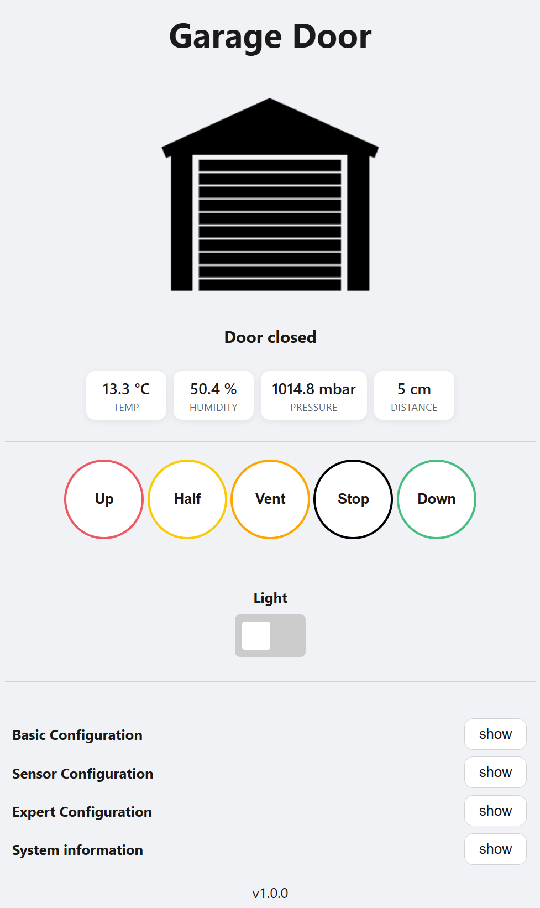
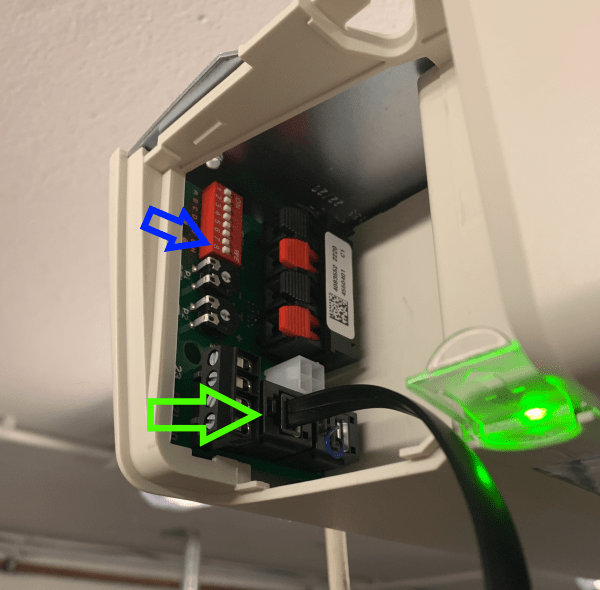
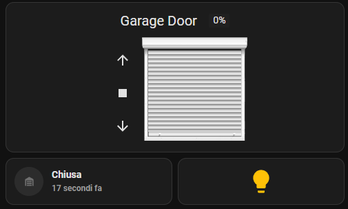

# :rocket: Buy a ready to use kit [here](https://github.com/Gifford47/HCPBridgeMqtt/discussions/83)
[Discussion & orders](https://github.com/Gifford47/HCPBridgeMqtt/discussions/83)

# Hörmann hormann — MQTT + Home Assistant

**Emulates Hörmann UAP1-HCP (HCP2) using an ESP32 + RS485 converter and exposes garage door controls via MQTT and a web UI.**

---

## Table of Contents
- [Quick Start](#quick-start)
- [Compatibility](#compatibility)
- [Features](#features)
- [Installation](#installation)
- [Web Interface](#web-interface)
- [MQTT & Home Assistant](#mqtt--home-assistant)
- [Configuration](#configuration)
- [OTA Updates](#ota-updates)
- [Sensors (optional)](#sensors-optional)
- [Troubleshooting](#troubleshooting)
- [Development & Contributing](#development--contributing)
- [License](#license)
- [Screenshots](#screenshots)

---

## Quick Start
1. Flash the firmware to an ESP32 (see `docs/` for build instructions).  
2. Connect ESP32 TX/RX to an RS485 converter and wire to the HCP bus.  
3. Power on the motor control board and run a BUS scan (see **Installation**).  
4. Connect to the device hotspot or your Wi-Fi and open the web interface (details below).  
5. Configure Wi-Fi and MQTT via the web UI or `config.json`.

If you just want to test: connect to hotspot `hormann` / password `gifford47`, open the web UI and set your MQTT broker.

---

## Compatibility
| Supported motors (UAP1-HCP / HCP2-Bus / Modbus) |
|---|
| SupraMatic E/P **Serie 4** |
| ProMatic **Serie 4** |
| [Rollmatic v2](docs/rollmatic_v2.md) |

> **Not compatible** with E**3** series motors (different protocol / layout). For older HCP1 hardware see other projects: [hgdo](https://github.com/steff393/hgdo), [hoermann_door](https://github.com/stephan192/hoermann_door), [hormann-hcp](https://github.com/raintonr/hormann-hcp).

---

## Features
- Read door status: open/closed/position, light on/off  
- Control: open, close, stop, light toggle, set position (half/vent/custom)  
- MQTT with Home Assistant Auto Discovery  
- Web Interface for configuration & control  
- OTA Updates  
- First-use hotspot (for out-of-the-box Wi-Fi setup)  
- Support for ESP32-S1/S2/S3 families  
- Optional external sensors (DS18x20, BME280, DHT22, HC-SR04, HC-SR501)  
- Efficient MQTT traffic (only publish on state change)  
- Support multiple HCP Bridges for several doors

---

## Installation

### Hardware
1. ESP32 → RS485 converter → HCP BUS (observe polarity and RS485 termination if needed).  
2. Ensure BUS +24V is present (some HW versions remove bus power when no devices detected).

### BUS Scan / First Run
- **Old hardware**: trigger BUS scan by flipping the last DIP switch (ON → OFF). Note: BUS power (+24V) may be removed when no devices detected — you can "jump start" using +24V from motor connectors if necessary.  
- **New hardware**: BUS scan via the LC display in menu `37`. See: [Supramatic 4 Busscan guide](https://www.tor7.de/news/bus-scan-beim-supramatic-serie-4-fehlercode-04-vermeiden)

---

## Web Interface
To access the web interface, first connect to the device’s automatic Wi-Fi hotspot.  
By default, the hotspot is named **`hormann`** and secured with the password **`gifford47`**.  

Once connected, open a web browser and go to:  
**http://[deviceip]**  
(you can also try **http://192.168.4.1** if you are connected directly to the hotspot).

When the login screen appears, use the following default credentials:
- **Username:** `admin`  
- **Password:** *(leave empty)*

After logging in, you will see the main control panel of the device.

### OTA Update Access
For performing OTA (Over-The-Air) updates, authentication uses a different set of credentials:
- **Username:** `admin`  
- **Password:** `admin`

---

## MQTT & Home Assistant

### MQTT topics (example)
hormann/<device_id>/state -> JSON with state/position/light/temperature
hormann/<device_id>/command -> payloads: OPEN, CLOSE, STOP, LIGHT_TOGGLE, SET_POSITION:50
hormann/<device_id>/sensor/<name>

### Home Assistant (MQTT Auto Discovery)
The project publishes Home Assistant discovery messages for:
- cover (shutter) entity with position support  
- binary_sensor for light / door open  
- sensors for temperature / humidity (if present)

Example `configuration.yaml` is not required when discovery is enabled. md`.

---

## Configuration
You can configure:
- Wi-Fi (hotspot or STA)  
- MQTT broker settings (host, port, user, password, base topic)  
- Device name and ID  
- Sensor thresholds and mapping  

Configuration can be done via the Web UI.

---

## Sensors (optional)
Supported optional sensors:
- DS18x20 (1-wire) — temperature  
- BME280 — temperature, humidity, pressure  
- DHT22 — temperature, humidity  
- HC-SR04 — distance (car detection)  
- HC-SR501 — PIR motion

Sensor readings are published to MQTT under `hormann/<device_id>/<sensor>` with configurable thresholds for triggered messages.

---

## Ventilation (vent) position
A small implementation supports a ventilation (vent) position and custom positioning. The vent behaviour uses a configured numeric position value. You can set custom positions with MQTT `SET_POSITION`.

---

## Troubleshooting
- **No BUS devices found:** check wiring, test +24V, try "jump start" with motor connector +24V. For old HW, ensure DIP-based scan is toggled.  
- **Cannot reach Web UI:** connect to hotspot `HCPBRIDGE` / try http://192.168.4.1. Check firewall or captive-portal on client device.  
- **MQTT messages not arriving:** verify broker settings, credentials, and that device is connected to Wi-Fi. Use a local MQTT client (mosquitto_sub) to debug.  
- **OTA fails:** confirm OTA credentials (admin/admin) and sufficient flash space. Use serial logs to inspect errors.

If you need help, start a discussion in the repo.

---

## Development & Contributing
Contributions welcome! Please:
1. Fork the repo  
2. Create a feature branch (`feat/my-change`)  
3. Open a PR with a clear description and tests where possible

---

## License
This project is licensed under the MIT License — see `LICENSE` for details.

---

## Screenshots

---

## More docs
- [Rollmatic v2 notes](docs/rollmatic_v2.md)  
- [Home Assistant examples](docs/homeassistant.md)  
- [Config examples](docs/config_examples/)

