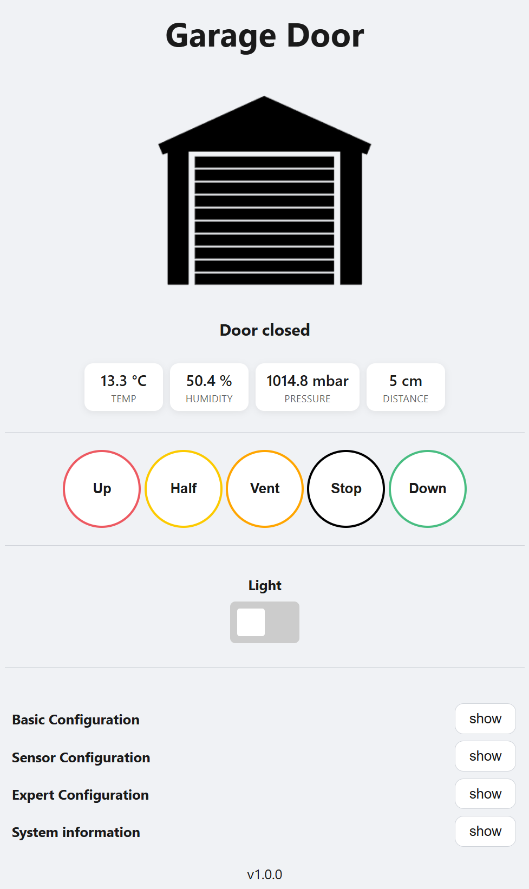
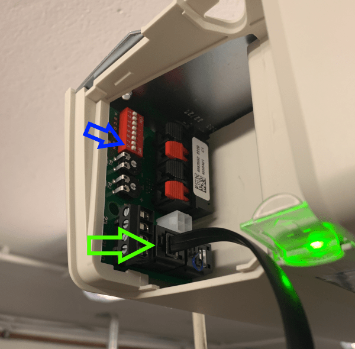
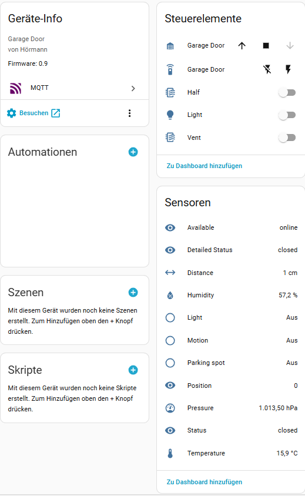
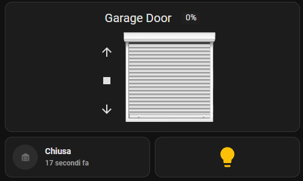

# :rocket: Buy a ready to use kit [here](https://github.com/Gifford47/HCPBridgeMqtt/discussions/83)
[Discussion & orders](https://github.com/Gifford47/HCPBridgeMqtt/discussions/83)  
[Getting started prebuild PCBs](docs/getting_started_prebuild_pcbs.md)  

## Support this project

If you like HCPBridge and want to support its development, consider sponsoring me! Your contribution helps cover development, testing and bug-fixing.

[](https://github.com/sponsors/gifford47)

# Hörmann hormann — MQTT + Home Assistant


**Emulates Hörmann UAP1-HCP (HCP2) using an ESP32 + RS485 converter and exposes garage door controls via MQTT and a web UI.**

---

## Table of Contents
- [Quick Start](#quick-start)
- [Compatibility](#compatibility)
- [Features](#features)
- [Installation](#installation)
- [Web Interface](#web-interface)
- [Factory Reset & Sensor Recovery](#factory-reset--sensor-recovery)
- [MQTT & Home Assistant](#mqtt--home-assistant)
- [Configuration](#configuration)
- [Sensors (optional)](#sensors-optional)
- [Digital Inputs & Outputs (optional)](#digital-inputs--outputs-optional)
- [Wi-Fi in multi-AP networks](#wi-fi-in-multi-ap-networks)
- [Ventilation (vent) position](#ventilation-vent-position)
- [Troubleshooting](#troubleshooting)
- [Development & Contributing](#development--contributing)
- [License](#license)
- [Screenshots](#screenshots)
- [More docs](#more-docs)

---

## Quick Start
1. Flash the firmware to an ESP32 (see `docs/` for build instructions).  
2. Connect ESP32 TX/RX to an RS485 converter and wire to the HCP bus.  
3. Power on the motor control board and run a BUS scan (see **Installation**).  
4. Connect to the device hotspot or your Wi-Fi and open the web interface (details below).  
5. Configure Wi-Fi, MQTT and any sensors via the web UI — everything is stored on the ESP32 itself.

If you just want to test: connect to hotspot `HCPBRIDGE` / password `gifford47`, open the web UI and set your MQTT broker.

---

## Compatibility
| Supported motors (UAP1-HCP / HCP2-Bus / Modbus) |
|---|
| SupraMatic E/P **Serie 4** |
| ProMatic **Serie 4** |
| [Rollmatic v2](docs/rollmatic_v2.md) |

> **Not compatible** with E**3** series motors (different protocol / layout). For older HCP1 hardware see other projects: [hgdo](https://github.com/steff393/hgdo), [hoermann_door](https://github.com/stephan192/hoermann_door), [hormann-hcp](https://github.com/raintonr/hormann-hcp).

---

## Features
- Read door status: open/closed/position, light on/off  
- Control: open, close, stop, light toggle, set position (half/vent/custom)  
- MQTT with Home Assistant Auto Discovery  
- Web Interface for configuration & control  
- OTA Updates  
- First-use hotspot (for out-of-the-box Wi-Fi setup)  
- Support for ESP32-S1/S2/S3 families  
- Optional external sensors (DS18x20, BME280, DHT22, HC-SR04, HC-SR501, MQ4)
- Optional digital inputs (wall button) and outputs (relay module) on the prebuilt PCBs
- Efficient MQTT traffic (only publish on state change)  
- Support multiple HCP Bridges for several doors

---

## Installation

### Hardware
1. Just plug-in the provided RJ12 cable (see [Screenshots](#screenshots))  
See also: [Getting started prebuild PCBs](docs/getting_started_prebuild_pcbs.md)  

### BUS Scan / First Run
- **Old hardware**: trigger BUS scan by flipping the last DIP switch (ON → OFF). Note: BUS power (+24V) may be removed when no devices detected — you can "jump start" using +24V from motor connectors if necessary.  
- **New hardware**: BUS scan via the LC display in menu `37`. See:
  - [Supramatic 4 Busscan guide EN](docs/bus_scan_EN.md)
  - [Supramatic 4 Busscan guide DE](docs/bus_scan_DE.md)

---

## Web Interface
To access the web interface, first connect to the device’s automatic Wi-Fi hotspot.  
By default, the hotspot is named **`HCPBRIDGE`** and secured with the password **`gifford47`**.  

Once connected, open a web browser and go to:  
**http://[deviceip]**  
(you can also try **http://192.168.4.1** if you are connected directly to the hotspot).

When the login screen appears, use the following default credentials:
- **Username:** `admin`  
- **Password:** *(leave empty)*

After logging in, you will see the main control panel of the device.

### OTA Update Access
For performing OTA (Over-The-Air) updates, authentication uses a different set of credentials:
- **Username:** `admin`  
- **Password:** `admin`


---

## Factory Reset & Sensor Recovery
The Boot button (GPIO 0) supports two reset levels:

| Presses (within 6s) | Action |
|---|---|
| **3x** | Disable all sensors and restart (sensor recovery) |
| **5x** | Full factory reset (clear all preferences) |

**Sensor recovery (3x press):**
If a faulty sensor causes boot problems, press the button 3 times to disable all sensors. The device will restart normally and you can fix the sensor configuration in the Web UI.

**Automatic crash recovery:**
If a sensor causes a crash (panic/watchdog), the firmware detects this on the next boot via `esp_reset_reason()` and automatically disables all sensors.

**Full factory reset (5x press):**
Clears all Wi-Fi, MQTT and sensor configuration. The device will restart with its default hotspot.

---

## MQTT & Home Assistant

All topics live under `hormann/<device_id>/`. The **Device ID** is set in the basic configuration and is limited to **14 characters** — longer IDs would overflow the discovery topic buffers.

**State topics (published by the bridge):**

| Topic | Content |
|---|---|
| `availability` | `online` / `offline` (last will) |
| `state` | JSON: `doorstate`, `doorposition`, `detailedState`, `lamp`, `vent`, `half`, `valid` |
| `position` | door position as an integer 0–100 |
| `sensor` | JSON with the enabled sensors: `temp`, `hum`, `pres`, `dist`, `free`, `motion`, `gas`, `gas_alarm` |
| `io` | JSON with the enabled digital channels: `in1`, `in2`, `out1`, `out2` |
| `debug` | JSON: `restart_reason`, `debug`, plus `sensor_error` / `io_error` when something failed |

**Command topics (subscribed by the bridge):**

| Topic | Payloads |
|---|---|
| `command/door` | `open`, `close`, `stop`, `step` |
| `command/lamp` | `true`, `false`, anything else toggles |
| `command/vent` | `venting` |
| `command/half` | `half` |
| `command/step` | `step` (impulse: open ↔ stop ↔ close) |
| `command/set_position` | `0` … `100` |
| `command/out1`, `command/out2` | `true`, `false`, anything else toggles |

Example:

```bash
mosquitto_pub -h broker -t 'hormann/hcpbridge/command/door' -m 'open'
mosquitto_pub -h broker -t 'hormann/hcpbridge/command/set_position' -m '50'
mosquitto_sub -h broker -t 'hormann/hcpbridge/#' -v
```

### Home Assistant (MQTT Auto Discovery)
Discovery messages are published **once at boot** (not on every reconnect) and adapt to what is actually enabled:

- `cover` — the garage door, with position support
- `switch` — light, vent, half position, and each enabled digital output
- `button` — impulse / toggle
- `sensor` — door status, detailed status, position, plus temperature / humidity / pressure / distance / gas for the enabled sensors, and the debug entities
- `binary_sensor` — light, parking space, motion, gas alarm, and each enabled digital input

Entities of sensors or I/O channels you switch off are removed again by clearing their retained discovery topic. No manual `configuration.yaml` entries are needed.

> If you change the **Device ID**, Home Assistant will create a new set of entities — the old ones stay behind as unavailable and have to be deleted manually.

---

## Configuration
Everything is configured in the Web UI and stored in the ESP32's flash — there is no config file to edit and **no separate firmware build per feature**. The compile-time values in `src/configuration.h` only provide the defaults for the very first boot.

The Web UI is split into four forms, each with its own *Save & Restart* button:

| Form | Contains |
|---|---|
| **Basic Configuration** | Wi-Fi (hotspot or client, "connect to strongest AP"), MQTT broker/credentials, Device ID (**max. 14 characters**) and device name, serial debug, web password |
| **Sensor Configuration** | Which sensors are active, their GPIOs, the polling interval and the publish thresholds |
| **I/O Configuration** | The In1/In2/Out1/Out2 channels: enable, GPIO, pull mode, inversion, local action, name |
| **Expert Configuration** | RS485 GPIOs and the entity names used for MQTT discovery |

**System information** shows firmware version, build environment, IP, Wi-Fi signal strength, free memory, reset reason and the state of every sensor and I/O channel, and links to the OTA update and factory reset pages.

---

## Sensors (optional)
Sensors are enabled via the Web UI under **Sensor Configuration** — one checkbox per sensor, with its GPIOs and thresholds next to it. If an enabled sensor is not connected or fails to initialize, the ESP will continue booting normally and report the error via the debug MQTT entity.

> **There is only one firmware per board any more.** Older releases shipped separate `…a` (without sensors) and `…b` (with sensors) binaries — those are gone. Flash `esp32-vX.Y.Z.bin`, `HCP_Giffordv2-vX.Y.Z.bin` or `HCP_Giffordv3-vX.Y.Z.bin` for your board and switch the sensors on in the Web UI.

Supported sensors:
- **BME280** (I2C) — temperature, humidity, pressure
- **DS18x20** (OneWire) — temperature
- **DHT22** — temperature, humidity
- **HC-SR04** (ultrasonic) — distance / **parking space detection**
- **HC-SR501** (PIR) — motion
- **MQ4** (analog) — methane / natural gas

Sensor readings are published to MQTT under `hormann/<device_id>/sensor` with configurable thresholds. Pins and thresholds are configurable in the Web UI.

### Parking Space Detection (HC-SR04)
The HC-SR04 ultrasonic sensor can be used to detect available parking space. The "Parking" feature (displayed as `"free": true/false` in MQTT):
- Measures distance to an object (e.g., car in garage)
- Tracks the **maximum distance ever measured** (represents empty space baseline)
- Compares current distance to max with a proximity threshold (default: 10cm)
- Publishes `true` when `(current_distance + threshold) > max_distance` → **space available** ✅
- Publishes `false` when occupied → **no parking space** ❌

**Configuration:**
- **Enable sensor:** Activate HC-SR04 in Sensor Configuration tab
- **Trigger & Echo pins:** Set custom GPIO pins for your board
- **Max distance:** Sensor range limit (default: 150cm)
- **Proximity threshold:** Distance margin for detection (default: 10cm, configurable as `sen_prox_thresh`)

### Sensor Safety
- Each sensor is tested up to **3 times** during boot before being marked as failed
- Failed sensors are shown with **red text** in the Web UI (last known value preserved)
- During normal operation, **5 consecutive poll failures** disable a sensor until reboot
- MQTT discovery and publishing skip failed sensors — no stale data sent to Home Assistant
- See [Factory Reset & Sensor Recovery](#factory-reset--sensor-recovery) for crash recovery options

---

## Digital Inputs & Outputs (optional)
The prebuilt HCP PCBs have four screw terminals — **In1**, **In2**, **Out1**, **Out2** — that are plain 3.3 V ESP32 GPIOs (the **HCP mini does not have them**). They are **disabled by default** and enabled per channel in the Web UI under **I/O Configuration**.

- **In1 / In2** — **≈5 V voltage inputs**, not dry-contact inputs: each sits behind a fixed 1.2 kΩ / 2.2 kΩ divider, so a signal of about 4–5 V against board GND reads as HIGH and the on-board 2.2 kΩ pulls the input LOW when nothing is applied. A push button therefore has to *switch 5 V* onto the terminal. **Never feed 12 V or 24 V in** — that destroys the GPIO. Each input becomes a Home Assistant `binary_sensor` and can additionally run a **local action** — toggle door, open, close, stop, **toggle light**, vent, half position — which keeps working when Wi-Fi/MQTT is down.
- **Out1 / Out2** — **high-side switches** (optocoupler-driven MOSFET). Switched on they *source* the voltage selected with the on-board `5V | – | 3V` jumper (minus about one MOSFET threshold), switched off they are high impedance. Suitable for PLC inputs, active-high relay module inputs and logic inputs; **not** for driving relays, lamps or motors directly. Each output becomes a Home Assistant `switch`.

| Terminal | HCP PCB v2 | HCP PCB v3.x |
|---|---|---|
| In1 | GPIO12 | GPIO12 |
| In2 | GPIO14 | GPIO14 |
| Out1 | GPIO37 | GPIO25 |
| Out2 | GPIO35 | GPIO22 |

MQTT: state on `hormann/<device_id>/io`, commands on `hormann/<device_id>/command/out1` and `/out2` (`true` / `false` / `toggle`). HTTP: `GET /io?output=1&state=toggle`.

➡️ **Full wiring details, electrical limits, all settings and examples: [Digital Inputs & Outputs](docs/inputs_outputs.md)**

---

## Wi-Fi in multi-AP networks
If the same SSID is broadcast by several access points (UniFi, mesh, repeaters), enable **Connect to strongest AP** in the basic configuration (default: on). The device then scans all channels and associates with the AP with the best signal, instead of the first one it happens to find. Turn it off to get the slightly faster (but signal-agnostic) fast scan on single-AP networks.

---

## Ventilation (vent) position
Besides fully open and closed, the door can be driven to the ventilation and half-open positions, and to any position in between. Use the buttons in the Web UI, the `vent` / `half` switches in Home Assistant, or publish to `command/vent`, `command/half` and `command/set_position` (0–100).

---

## Troubleshooting
- **No BUS devices found:** check wiring, test +24V, try "jump start" with motor connector +24V. For old HW, ensure DIP-based scan is toggled.  
- **Cannot reach Web UI:** connect to hotspot `HCPBRIDGE` / try http://192.168.4.1. Check firewall or captive-portal on client device.  
- **MQTT messages not arriving:** verify broker settings, credentials, and that device is connected to Wi-Fi. Use a local MQTT client (mosquitto_sub) to debug.  
- **Entities missing or duplicated in Home Assistant:** discovery is only sent at boot — restart the bridge after enabling a sensor or I/O channel. Check that the **Device ID** is at most 14 characters; a longer ID truncates the discovery topics.  
- **Connection drops / slow Web UI:** open **System information** and check the signal strength. Yellow (−68 … −80 dBm) is workable, red (below −80 dBm) is not — move the antenna or see [Wi-Fi in multi-AP networks](#wi-fi-in-multi-ap-networks).  
- **OTA fails:** confirm OTA credentials (admin/admin) and sufficient flash space. Use serial logs to inspect errors.

If you need help, start a discussion in the repo.

---

## Development & Contributing
Contributions welcome! Please:
1. Fork the repo  
2. Create a feature branch (`feat/my-change`)  
3. Open a PR with a clear description and tests where possible

---

## License
This project is licensed under the MIT License — see `LICENSE` for details.

---

## Screenshots






---

## More docs
- [Rollmatic v2 notes](docs/rollmatic_v2.md)
- [Digital Inputs & Outputs (In1/In2/Out1/Out2)](docs/inputs_outputs.md)  
