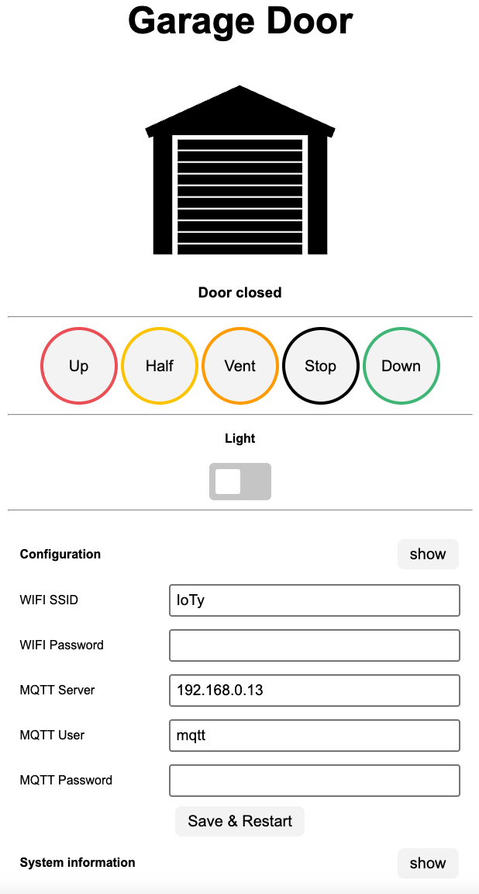

# Hörmann HCPBridge with MQTT and HomeAssistant Support

Emulates Hörmann UAP1-HCP board (HCP2= Hörmann communication protocol 2) using an ESP32 and a RS485 converter, and exposes garage door controls over web page and MQTT.

**Compatible with the following motors (UAP1-HCP / HCP2-Bus / Modbus):**

* SupraMatic E/P **Serie 4**
* ProMatic **Serie 4**
* [Rollmatic v2](docs/rollmatic_v2.md)

It is **not** compatible with E**3** series motors. Previous generations have different protocol (HCP1), different pin layout, and already have another supporting project (see [hgdo](https://github.com/steff393/hgdo), [hoermann_door](https://github.com/stephan192/hoermann_door) or [hormann-hcp](https://github.com/raintonr/hormann-hcp)).

## Functions

* Get current status (door open/close/position, light on/off)
* Support for ESP32-S1/S2/S3
* Support multiple HCP Bridges for multiple garage doors
* HomeAssistant integration via MQTT-AutoDiscovery
* Trigger actions via Webinterface
  * light on/off
  * gate open, close, stop
  * gate position: half, ventilation, custom (MQTT set_position compatible)
* Configuration (Wifi, MQTT, ...) via Web Interface
* Web Service [API](#web-service)
* OTA Update (with username and password)
* First Use Hotspot for configuration
* External (optional) sensor support (threshold orientated MQTT messages):
  * DS18X20 temperature sensor
  * BME280 temperature and humidity sensor
  * DHT22 temperature and humidity sensor
  * HC-SR04 proximity sensor (car (below) detection)
  * HC-SR501 PIR motion sensor
* Efficient MQTT traffic (send only MQTT Message if states changed)

## Web Interface

***http://[deviceip]***

# Buy a ready to use kit [here](https://github.com/Gifford47/HCPBridgeMqtt/discussions/83) :rocket:

