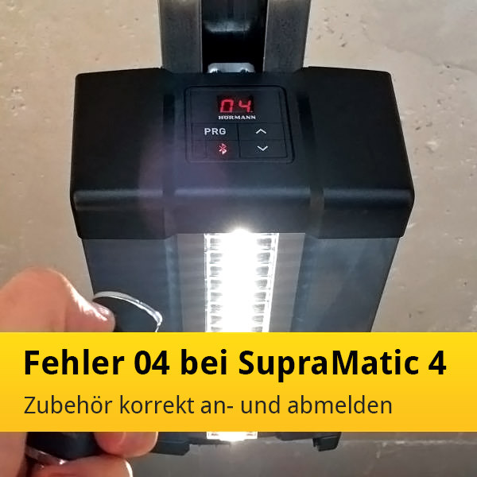
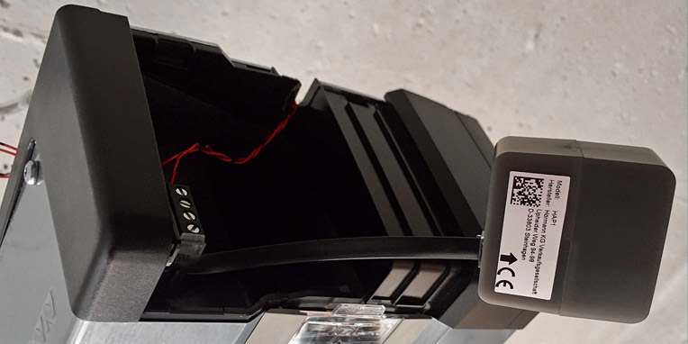
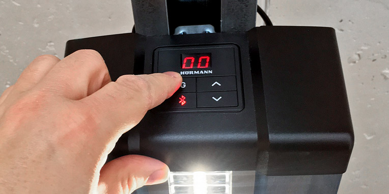
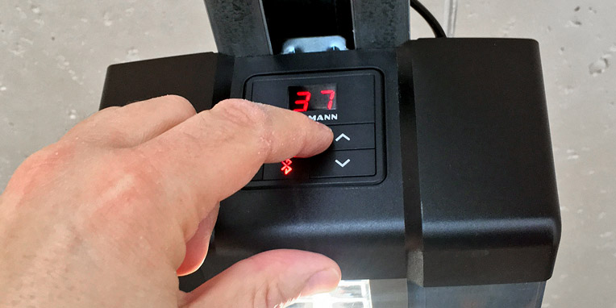
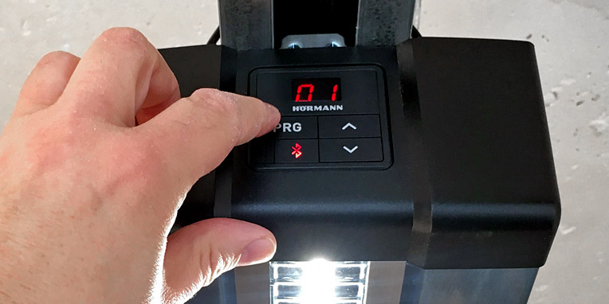
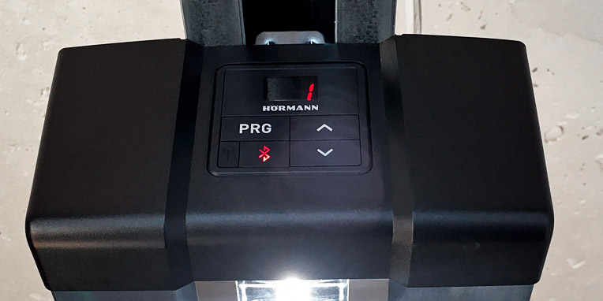
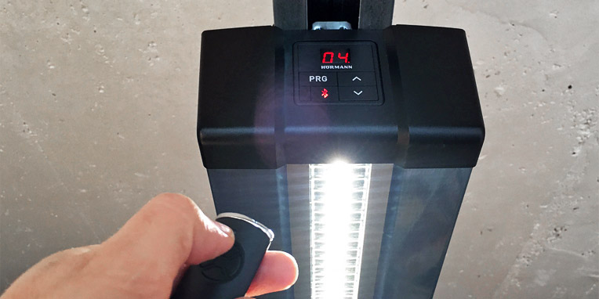
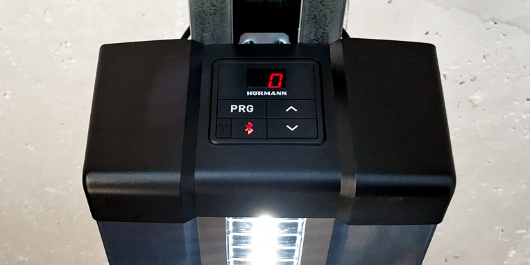

# Bus-Scan beim SupraMatic Serie 4 – Fehlercode 04 vermeiden

> **Problem:**  
> Fehler nach Anschließen oder Abstecken von Zubehör?  
> Das kann bei Hörmann-Antrieben mit HCP2-Bus-Anschluss vorkommen.  
> Kein Grund zur Sorge – hier erfahren Sie, wie Sie den Fehler 04 vermeiden.

---

## 🔍 04 – Warum die Fehlermeldung?

Beim älteren **HCP1-Bus-Anschluss** konnte Zubehör einfach ein- und ausgesteckt werden – es funktionierte sofort.  
Beim neuen **HCP2-Bus-Anschluss** ist das anders:  
Hier sorgt ein sogenannter **Bus-Scan** für das An- und Abmelden jedes kompatiblen Geräts.  
Diese Technologie verhindert Fehlfunktionen, erfordert aber ein bestimmtes Vorgehen.

---

## ⚙️ Zubehör am HCP2-Bus anschließen und entfernen

Vor **jedem Anschließen oder Entfernen** von Zubehör am HCP2-Bus muss ein **Bus-Scan** durchgeführt werden.  
Dazu:

1. Den Antrieb **vom Strom trennen**.  
2. Zubehör einstecken oder entfernen.  
3. Antrieb **wieder an den Strom anschließen**.  
4. Der Bus-Scan startet automatisch.

---

## 🧭 Bus-Scan beim SupraMatic Serie 4 durchführen

Die Modelle **SupraMatic** und **ProMatic Serie 4** sind mit dem HCP2-Bus ausgestattet.  
Im Beispiel wird eine **HAP1 (Hörmann Adapterplatine 1)** angeschlossen.

### Zubehör anmelden (SupraMatic E/P Serie 4)

1. **Stromkabel ziehen.**  
   Zubehör im stromlosen Zustand anschließen. Danach Strom wieder einstecken.
2. **Programmiermenü öffnen.**  
   `PRG`-Taste gedrückt halten → Anzeige `00`.

   
3. **Menü 37 auswählen.**  
   Über Pfeiltasten navigieren.

   
4. **Parameter 01 öffnen.**

   
5. **Bus-Scan starten.**  
   `P`-Taste gedrückt halten, bis **bS** im Display erscheint → loslassen.

   
6. Während des Scans blinkt **bS**.  
   Nach erfolgreichem Scan zeigt das Display **1** – das Zubehör wurde erkannt.

   

---

### Zubehör abmelden

Wenn Zubehör ohne Scan ein- oder ausgesteckt wird, zeigt der Antrieb **Fehlercode 04**:

Zum **Abmelden**:

1. **Antrieb stromlos schalten.**
2. Zubehör abstecken.
3. Strom wieder anschließen.
4. **Bus-Scan erneut durchführen.**

Nach erfolgreichem Scan zeigt das Display kurz eine **0** – das Zubehör wurde abgemeldet.

---

## 🔌 Bus-Scan beim ProMatic Serie 4

Beim **ProMatic Serie 4** ist der **DIL-Schalter H (Nr. 8)** für den Bus-Scan zuständig:

1. Schalter auf **ON** stellen (Scan startet).  
2. Danach wieder auf **OFF** zurückstellen.

⚠️ Bei jedem Anschluss oder Entfernen von Zubehör muss der Bus-Scan erneut durchgeführt werden.

---

## 💡 Wofür sind die HCP-Bus-Anschlüsse gut?

**HCP = Hörmann Communication Protocol**

Damit können zahlreiche Zubehörteile angeschlossen werden, z. B.:

- Universaladapterplatinen  
- Optionsrelais  
- Smarthome-Module

### HCP1-Bus
- Verfügbar bei **RotaMatic**, **LineaMatic**, **VersaMatic**  
  sowie **SupraMatic Serie 2 & 3**  
- Unterstützt Gateways für **Homematic**, **DeltaDore**, **Apple HomeKit**

### HCP2-Bus
- Aktuell nur in **ProMatic Serie 4** und **SupraMatic Serie 4**
- Voraussetzung für **KNX-Gateways**

Mit den Adapterplatinen können Sie zusätzliche Funktionen konfigurieren:
- Tor-Auf / Tor-Zu  
- Stopp  
- Teilöffnung  
- Licht  
- Lüftungsposition

---

## 🔗 Weitere Informationen

➡️ [Hilfe zu möglichen Fehlermeldungen vom Toröffner SupraMatic](https://www.tor7.de/news/hilfe-zu-den-moeglichen-fehlermeldungen-vom-toroeffner-supramatic)

---

*Quelle: [tor7.de – Bus-Scan beim SupraMatic Serie 4 Fehlercode 04 vermeiden](https://www.tor7.de/news/bus-scan-beim-supramatic-serie-4-fehlercode-04-vermeiden)*
