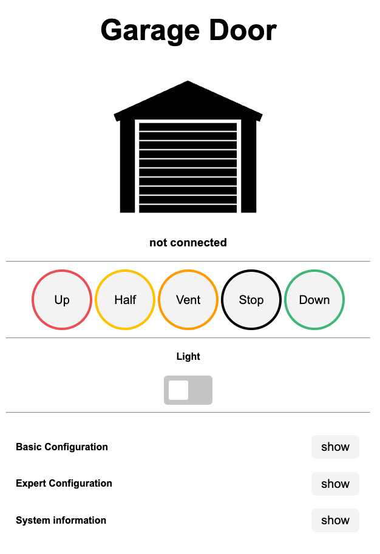
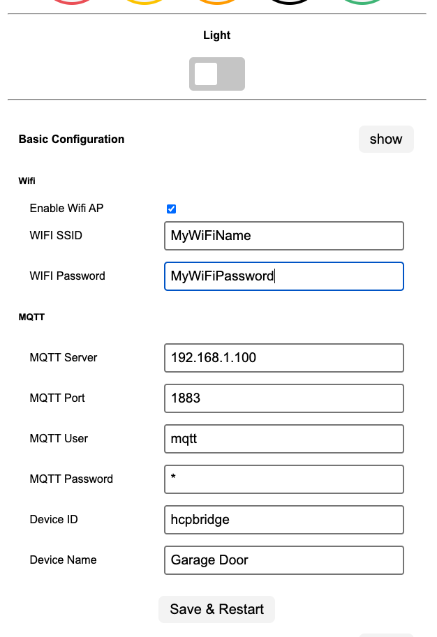
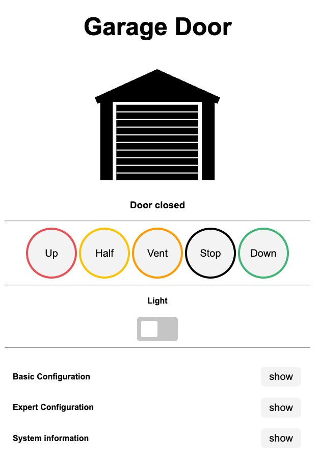

# Getting started with prebuilt PCBs

If you bought a prebuilt PCB, you can follow this step-by-step guide to set up your HCP-Bridge with your Hörmann garage door.  
These instructions focus on the **Gifford47 PCB** version, but the process is very similar for all other board versions.

---

## 🔌 Installing Sensors

If you want to connect **temperature sensors** or any other sensors, follow these steps carefully:

1. **Solder pin headers** to the dedicated sensor pads on the **Gifford47 PCB**.  
   Make sure the pins are properly aligned and the solder joints are clean and solid.
2. **Attach the sensors** to the corresponding pin headers according to the pinout.
3. **Reinstall the PCB** into your **SupraMatic** unit.
4. **Enable the sensors in the Web UI** under **Sensor Configuration** — tick the sensor you connected, check its GPIO pins and save. The device restarts and the sensor appears in the status area and in Home Assistant.

⚠️ **Note:** There are no separate firmware variants for sensors any more. Older releases had `…a` (without sensors) and `…b` (with sensors) binaries — since the sensors became configurable in the Web UI there is **one firmware per board**: `HCP_Giffordv2-vX.Y.Z.bin` or `HCP_Giffordv3-vX.Y.Z.bin`. If you are still running an `a`/`b` build, update via **OTA Update** in the Web UI.

## 🔘 Using the In1 / In2 / Out1 / Out2 terminals

Next to the sensor pads the PCB has four extra screw terminals. They are plain
3.3 V ESP32 GPIOs (the **HCP mini does not have them**):

* **In1 / In2** — **≈5 V signal inputs** (fixed 1.2 kΩ / 2.2 kΩ divider on the board), not dry-contact inputs. A push button must therefore *switch 5 V* onto the terminal; the on-board 2.2 kΩ pulls the input low again when it is released. Never apply 12 V or 24 V. Each input can trigger a local action such as *toggle light* or *impulse*, and shows up in Home Assistant as a `binary_sensor`.
* **Out1 / Out2** — **high-side switches** (optocoupler-driven MOSFET). Switched on they *source* the voltage set by the `5V | – | 3V` jumper, switched off they are high impedance. Use them for PLC inputs, active-high relay module inputs or logic inputs; never to drive a load directly. Each output shows up as a Home Assistant `switch`.

Both are **disabled by default** and are enabled in the Web UI under **I/O Configuration**.

➡️ Full details, wiring diagrams, limits and examples: [Digital Inputs & Outputs](inputs_outputs.md)

## What you need

* Prebuild PCB with HCPBridge Firmware installed (installed out of the box on gifford PCBs)
* USB-C power supply (PCB-Revision >=3)
* Optional: 3.3V power Supply (min. 500mA) if you want to test the board standalone

## Initial configuration

### 1. Connect the PCB to power via the USB-C connector/ 3.3V power supply and wait a few seconds. the LED will be lit.
### 2. Search and connect to the WIFI Network called "HCPBRIDGE" the PCB creates with a phone or pc.
### 3. When connected, open a webbrowser and go to the WEBUI under the following url : http://192.168.4.1

### 4. Open the "Basic Configuration" tab and enter your WIFI and MQTT credentials, then click save.

> Note: The wifi password has to be ASCII chars between ASCII 32-126.

> Tip: To disable the wifi AP just uncheck the "Enable wifi AP" checkbox and save

### 5. The PCB should now be connected to your wifi. You can now check if it is reachable from your home network and if it connected to your MQTT Server.

## Installation

### 1. connect the PCB with a RJ12 cable to the BUS port on your Hörmann garage door motor (image below, see green arrow).

   
### 2. Figure out how to execute a bus scan on your model, see info below or have a look in your motors ueer manual.

**ProMatic Serie 4**

Use the bottom dip switch (see image above, blue arrow) and toggle it, this will start the buss can.

**SupraMatic E/P Serie 4**

Use the Buttons to navigate to the menu 37 and excecute the Bus Scan, see here: [Tor7.de - Supramatic Bus Scan](https://www.tor7.de/news/bus-scan-beim-supramatic-serie-4-fehlercode-04-vermeiden)
  
### 3. execute a bus scan on your garage door motor, this should make the PCB light up (3V3) and blink rapidly (RS485 module)
### 4. if the bus scan was succesfully you can connect to the WEBUI and control your garage door motor, it should look like in the image below.

